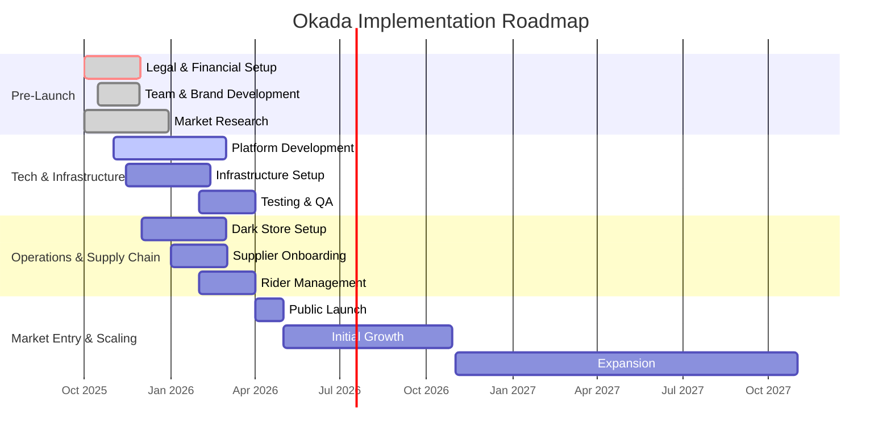

# Okada: Comprehensive Implementation Checklist

## Phase 1: Pre-Launch (Months 1-4)

### Week 1-4: Foundation & Planning

- [ ] **Corporate Setup**
    - [ ] Register the business entity in Cameroon.
    - [ ] Secure necessary business licenses and permits.
    - [ ] Open a corporate bank account.
- [ ] **Team Recruitment**
    - [ ] Hire core team: Product Manager, Lead Engineer, Operations Manager.
    - [ ] Begin recruitment for developers and UI/UX designer.
- [ ] **Legal & Compliance**
    - [ ] Engage local legal counsel.
    - [ ] Review labor laws, data privacy regulations, and e-commerce policies.
- [ ] **Technology**
    - [ ] Finalize technology stack.
    - [ ] Set up development environments and version control (Git).
    - [ ] Define detailed technical architecture.

### Week 5-12: MVP Development & Setup

- [ ] **Product Development (Agile Sprints)**
    - [ ] **Sprint 1-2**: UI/UX design for all apps (Customer, Rider, Dark Store).
    - [ ] **Sprint 3-4**: Backend setup, database schema, user authentication.
    - [ ] **Sprint 5-6**: Customer App - product browsing, cart, checkout.
    - [ ] **Sprint 7-8**: Mobile Money integration (MTN & Orange Money).
    - [ ] **Sprint 9-10**: Rider App - order management, navigation.
    - [ ] **Sprint 11-12**: Dark Store App - inventory, order fulfillment.
- [ ] **Operations Setup**
    - [ ] Identify and secure first dark store locations in Douala and Yaoundé.
    - [ ] Begin negotiations with local suppliers and farmers.
    - [ ] Develop partnerships with Okada rider associations.
- [ ] **Marketing**
    - [ ] Develop brand identity (logo, colors, messaging).
    - [ ] Create a simple landing page website.
    - [ ] Set up social media profiles (Facebook, Instagram).

### Week 13-16: Testing & Pilot

- [ ] **Technology**
    - [ ] End-to-end testing of the entire platform.
    - [ ] Conduct security audit.
    - [ ] Deploy apps to Google Play Store for closed beta testing.
- [ ] **Operations**
    - [ ] Set up the first dark store with shelving, packing stations, and internet.
    - [ ] Onboard first batch of Okada riders and provide training.
    - [ ] Stock the dark store with initial inventory.
- [ ] **Pilot Program**
    - [ ] Launch a private pilot with a small group of users (friends, family, early sign-ups).
    - [ ] Collect feedback on the entire user experience.
    - [ ] Iterate on the product based on pilot feedback.

## Phase 2: Launch & Optimization (Months 5-12)

### Month 5: Public Launch

- [ ] **Marketing**
    - [ ] Announce public launch on social media and through press releases.
    - [ ] Run initial user acquisition campaigns (e.g., first-order discounts).
    - [ ] Engage local influencers for launch day promotions.
- [ ] **Operations**
    - [ ] Scale up rider onboarding to meet demand.
    - [ ] Closely monitor dark store inventory and supply chain.
- [ ] **Support**
    - [ ] Ensure customer support channels (WhatsApp, phone) are fully staffed.

### Month 6-12: Growth & Optimization

- [ ] **Product Development**
    - [ ] Begin development of Phase 2 features (iOS app, promotions, reviews).
    - [ ] Continuously improve app performance and user experience based on user feedback and analytics.
- [ ] **Operations**
    - [ ] Open additional dark stores in Douala and Yaoundé.
    - [ ] Optimize delivery routes and rider efficiency using data.
    - [ ] Refine inventory management to reduce stockouts and waste.
- [ ] **Marketing**
    - [ ] Analyze CAC and LTV to optimize marketing spend.
    -  [ ] Launch referral programs and loyalty campaigns.
- [ ] **Data & Analytics**
    - [ ] Build out the admin dashboard with advanced analytics.
    - [ ] Track KPIs and report on business performance weekly.

## Phase 3: Scale & Diversification (Months 13+)

### Month 13-18: Market Expansion

- [ ] **Expansion Planning**
    - [ ] Conduct market research for the next target city (e.g., Bafoussam, Limbe).
    - [ ] Develop a detailed expansion plan and budget.
- [ ] **Product Development**
    - [ ] Begin development of Phase 3 features ("Okada Prime", new categories).
    - [ ] Implement multi-language support (French and English).
- [ ] **Operations**
    - [ ] Launch operations in the new city.

### Month 19+: Diversification & Maturity

- [ ] **Business Development**
    - [ ] Explore partnerships with restaurants, pharmacies, and other local businesses.
    - [ ] Investigate B2B opportunities (e.g., office pantry supplies).
- [ ] **Technology**
    - [ ] Invest in data science capabilities for demand forecasting and personalization.
    - [ ] Explore new technologies to enhance the platform (e.g., AI-powered customer support).
- [ ] **Team Growth**
    - [ ] Scale the team to support a larger, more complex operation.

## Continuous Activities (All Phases)

- [ ] **Customer Feedback**: Regularly collect and analyze user feedback from all channels.
- [ ] **Performance Monitoring**: Continuously track KPIs and business metrics.
- [ ] **Team Meetings**: Hold regular stand-ups, sprint planning, and retrospectives.
- [ ] **Financial Management**: Manage burn rate, forecast cash flow, and plan for future fundraising rounds.
- [ ] **Regulatory Compliance**: Stay up-to-date with any changes in local regulations.

## Phase 2: Technology and Infrastructure Setup (Months 2-5)

This phase focuses on building the core technology platform and setting up the necessary infrastructure for launch.

### 2.1. Technology Stack and Architecture

| Task ID | Task Description | Status | Dependencies | Notes |
| :--- | :--- | :--- | :--- | :--- |
| TI-01 | Finalize the technology stack for mobile apps, backend, and database. | Not Started | PL-14 | Recommended: React Native (for cross-platform mobile apps), Node.js or Python (for backend), and PostgreSQL or MongoDB (for database). |
| TI-02 | Design a scalable and resilient microservices-based architecture. | Not Started | TI-01 | This will allow for independent development and scaling of different platform components. |
| TI-03 | Set up development, staging, and production environments. | Not Started | TI-01 | Use cloud infrastructure providers like AWS, Google Cloud, or Azure. |
| TI-04 | Implement a CI/CD pipeline for automated testing and deployment. | Not Started | TI-03 | Tools like Jenkins, GitLab CI, or GitHub Actions can be used. |

### 2.2. Platform Development (Customer, Rider, and Dark Store Apps)

| Task ID | Task Description | Status | Dependencies | Notes |
| :--- | :--- | :--- | :--- | :--- |
| TI-05 | Develop the UI/UX design for all three mobile applications. | Not Started | PL-09, PL-15 | Focus on a simple, intuitive, and lightweight design optimized for low-bandwidth conditions. |
| TI-06 | Build the customer-facing app (Android first) with core features. | Not Started | TI-05 | Core features: user registration/login, product browsing, search, cart management, and order placement. |
| TI-07 | Integrate mobile money payment gateways (MTN Mobile Money, Orange Money). | Not Started | TI-06, PL-20 | This is a critical feature for the Cameroonian market. |
| TI-08 | Develop the rider app with order management, navigation, and earnings tracking. | Not Started | TI-05 | Navigation should be optimized for local conditions, potentially integrating with local mapping services if available. |
| TI-09 | Create the dark store management app for inventory tracking, order picking, and packing. | Not Started | TI-05 | The app should be designed for speed and efficiency to minimize order processing time. |

### 2.3. Core Backend and API Development

| Task ID | Task Description | Status | Dependencies | Notes |
| :--- | :--- | :--- | :--- | :--- |
| TI-10 | Develop the user management service for authentication and authorization. | Not Started | TI-02 | Implement secure password handling and session management. |
| TI-11 | Build the product and inventory management service. | Not Started | TI-02 | This service will handle product catalog, stock levels, and pricing. |
| TI-12 | Create the order management service to process orders from placement to delivery. | Not Started | TI-02 | This is the core of the platform, orchestrating the entire order lifecycle. |
| TI-13 | Develop the payment service to handle transactions with mobile money providers. | Not Started | TI-02, TI-07 | Ensure secure and reliable payment processing. |
| TI-14 | Build the delivery and logistics service for rider assignment and route optimization. | Not Started | TI-02 | This service will be crucial for achieving the 15-30 minute delivery promise. |

### 2.4. Infrastructure and Deployment

| Task ID | Task Description | Status | Dependencies | Notes |
| :--- | :--- | :--- | :--- | :--- |
| TI-15 | Set up the cloud server infrastructure for hosting the backend services. | Not Started | TI-03 | Use auto-scaling groups to handle fluctuations in traffic. |
| TI-16 | Configure the database and ensure regular backups are in place. | Not Started | TI-03 | Choose a database that can scale with the platform's growth. |
| TI-17 | Deploy the backend services to the production environment. | Not Started | TI-14, TI-15, TI-16 | Follow a phased deployment strategy to minimize risks. |
| TI-18 | Publish the mobile apps to the Google Play Store (for Android). | Not Started | TI-06, TI-08, TI-09 | Prepare all necessary app store assets and descriptions. |

### 2.5. Testing and Quality Assurance

| Task ID | Task Description | Status | Dependencies | Notes |
| :--- | :--- | :--- | :--- | :--- |
| TI-19 | Implement a comprehensive testing strategy, including unit, integration, and end-to-end testing. | Not Started | TI-04 | Automate as much of the testing process as possible. |
| TI-20 | Conduct thorough security testing to identify and address vulnerabilities. | Not Started | TI-17 | Engage a third-party security firm for an independent audit. |
| TI-21 | Perform user acceptance testing (UAT) with a closed group of beta testers. | Not Started | TI-18 | Gather feedback on the user experience and identify any usability issues. |
| TI-22 | Fix all critical and high-priority bugs before the public launch. | Not Started | TI-21 | Ensure a stable and reliable platform for the initial launch. |

## Phase 3: Operations and Supply Chain Setup (Months 3-6)

This phase runs in parallel with technology development and focuses on building the physical infrastructure and processes for order fulfillment.

### 3.1. Dark Store Setup and Launch

| Task ID | Task Description | Status | Dependencies | Notes |
| :--- | :--- | :--- | :--- | :--- |
| OS-01 | Secure and lease the first 2-3 dark store locations in Douala and Yaoundé. | Not Started | PL-06 | Locations should be in high-density residential areas with good road access. |
| OS-02 | Design the layout of the dark stores for optimal picking and packing efficiency. | Not Started | OS-01 | The layout should be based on the curated product selection and order volume projections. |
| OS-03 | Procure and install all necessary equipment for the dark stores. | Not Started | OS-01 | Includes shelving, packing stations, refrigerators/freezers, and backup generators. |
| OS-04 | Set up internet connectivity and the local network in each dark store. | Not Started | OS-03 | A reliable internet connection is critical for the dark store management app. |
| OS-05 | Hire and train dark store managers and staff. | Not Started | OS-01 | Staff should be trained on inventory management, order processing, and quality control. |

### 3.2. Supplier Onboarding and Procurement

| Task ID | Task Description | Status | Dependencies | Notes |
| :--- | :--- | :--- | :--- | :--- |
| OS-06 | Finalize agreements with key local suppliers for the initial product catalog. | Not Started | PL-19 | Agreements should cover pricing, delivery schedules, and quality standards. |
| OS-07 | Develop a supplier onboarding process and provide training to suppliers on using the vendor portal (if applicable). | Not Started | OS-06 | A smooth onboarding process is crucial for building strong supplier relationships. |
| OS-08 | Establish a quality control process for all incoming products. | Not Started | OS-06 | This includes checking for freshness, quality, and expiry dates. |
| OS-09 | Set up the initial inventory in the dark stores based on demand projections. | Not Started | OS-06, TI-11 | Use the inventory management system to track all stock movements. |

### 3.3. Last-Mile Delivery and Rider Management

| Task ID | Task Description | Status | Dependencies | Notes |
| :--- | :--- | :--- | :--- | :--- |
| OS-10 | Formalize partnerships with Okada rider associations. | Not Started | PL-18 | The partnership agreement should define roles, responsibilities, and payment terms. |
| OS-11 | Develop a rider onboarding and training program. | Not Started | OS-10 | Training should cover app usage, customer service, and safety protocols. |
| OS-12 | Onboard the initial batch of Okada riders for the launch. | Not Started | OS-11 | Ensure all riders have a smartphone and a registered mobile money account. |
| OS-13 | Distribute branding materials (e.g., jackets, delivery bags) to the riders. | Not Started | OS-12, PL-15 | This will help to build brand visibility and trust. |
| OS-14 | Establish a system for rider payments and incentives. | Not Started | OS-10, TI-13 | Payments should be made promptly and transparently through mobile money. |

### 3.4. Customer Support and Service

| Task ID | Task Description | Status | Dependencies | Notes |
| :--- | :--- | :--- | :--- | :--- |
| OS-15 | Set up customer support channels (e.g., WhatsApp, phone number, email). | Not Started | - | Customer support should be available in both French and English. |
| OS-16 | Hire and train customer support representatives. | Not Started | OS-15 | Representatives should be knowledgeable about the platform and products. |
| OS-17 | Develop a set of standard operating procedures (SOPs) for handling customer inquiries and complaints. | Not Started | OS-16 | SOPs should cover common issues like order errors, delivery delays, and payment problems. |
| OS-18 | Implement a system for collecting and analyzing customer feedback. | Not Started | OS-15 | Customer feedback is crucial for identifying areas for improvement. |

## Phase 4: Market Entry and Scaling (Months 6+)

This phase begins with the public launch and focuses on user acquisition, performance optimization, and strategic expansion.

### 4.1. Launch and Initial Growth (Months 6-12)

| Task ID | Task Description | Status | Dependencies | Notes |
| :--- | :--- | :--- | :--- | :--- |
| ME-01 | Execute the public launch of Okada in the initial target neighborhoods. | Not Started | TI-22, OS-12 | Coordinate the launch with a targeted marketing campaign. |
| ME-02 | Implement the initial user acquisition strategy. | Not Started | ME-01 | Focus on digital marketing (social media, search ads) and offline marketing (flyers, community events). |
| ME-03 | Offer launch promotions and referral programs to drive initial adoption. | Not Started | ME-01 | E.g., first-order discounts, referral bonuses for both the referrer and the new user. |
| ME-04 | Closely monitor key performance indicators (KPIs) from day one. | Not Started | ME-01 | KPIs: customer acquisition cost (CAC), lifetime value (LTV), order volume, delivery time, and customer satisfaction. |
| ME-05 | Continuously optimize operations based on real-time data and customer feedback. | Not Started | ME-04 | This includes adjusting inventory, optimizing delivery routes, and improving the app experience. |
| ME-06 | Gradually expand the delivery zones within Douala and Yaoundé. | Not Started | ME-04 | Expansion should be data-driven, based on demand and operational capacity. |

### 4.2. Scaling and Expansion (Months 13+)

| Task ID | Task Description | Status | Dependencies | Notes |
| :--- | :--- | :--- | :--- | :--- |
| ME-07 | Develop a data-driven framework for evaluating and prioritizing new cities for expansion. | Not Started | ME-04 | The framework should consider market size, competition, infrastructure, and operational complexity. |
| ME-08 | Plan and execute the expansion to a third city (e.g., Bafoussam or Limbe). | Not Started | ME-07 | Replicate the successful launch playbook from the initial cities. |
| ME-09 | Introduce new product categories and services based on customer demand. | Not Started | ME-04 | E.g., pharmaceuticals, electronics, or partnerships with local restaurants. |
| ME-10 | Explore and test a subscription model ("Okada Prime") to increase customer loyalty and recurring revenue. | Not Started | ME-04 | The subscription model should offer clear value to the customer (e.g., free delivery, exclusive discounts). |
| ME-11 | Invest in data science and machine learning capabilities for advanced demand forecasting and personalization. | Not Started | ME-04 | This will be a key competitive advantage in the long run. |
| ME-12 | Develop a B2B offering for corporate clients (e.g., office pantry supplies). | Not Started | ME-04 | This can provide a stable and predictable revenue stream. |
| ME-13 | Continuously assess the competitive landscape and adapt the strategy accordingly. | Not Started | - | The quick commerce market is dynamic, and Okada must be agile to stay ahead. |
| ME-14 | Plan for future fundraising rounds to finance expansion and growth. | Not Started | PL-10, ME-04 | The financial model should be updated regularly to reflect actual performance. |

## Phase 5: Implementation Roadmap and Timeline

This high-level roadmap provides a visual overview of the key phases and milestones for the launch and scaling of Okada in Cameroon.

### High-Level Timeline

| Phase | Duration | Key Milestones |
| :--- | :--- | :--- |
| **Phase 1: Pre-Launch Preparation** | **Months 1-3** | - Legal entity registered - Seed funding secured - Core team hired - Initial market research completed |
| **Phase 2: Tech & Infrastructure Setup** | **Months 2-5** | - MVP of all three apps developed - Cloud infrastructure deployed - Mobile money integration completed - Beta testing concluded |
| **Phase 3: Operations & Supply Chain Setup** | **Months 3-6** | - First dark stores operational - Initial supplier and rider partnerships established - Staff hired and trained - Customer support channels live |
| **Phase 4: Market Entry & Scaling** | **Months 6+** | - Public launch in Douala and Yaoundé - User acquisition and growth campaigns - Continuous optimization of operations - Expansion to new cities and services |

### Gantt Chart (Illustrative)

### Critical Dependencies and Risks

- **Funding**: Securing timely funding is critical for all phases of the project.
- **Regulatory Environment**: Any changes in local regulations could impact operations.
- **Infrastructure**: The success of the model is highly dependent on the quality of road and internet infrastructure.
- **Competition**: The emergence of a well-funded competitor could impact market share and growth.
- **Execution**: The ability to execute the plan efficiently and adapt to local challenges will be the ultimate determinant of success.

This preliminary implementation checklist provides a comprehensive framework for launching Okada in Cameroon. It is a living document that should be continuously updated and refined as the project progresses and more information becomes available.

